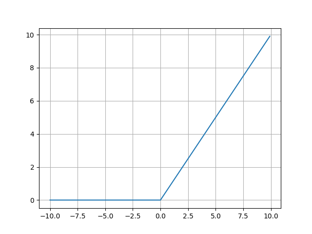

# Activation function implementation with Numpy

* ### Sigmoid activation function

The sigmoid function is a mathematics function having a characteristic "S"-shaped curve or sigmoid curve. as writen here
[Sigmoid function](https://en.wikipedia.org/wiki/Sigmoid_function)

Sometimes referred to as a logistic function it is also a non-linear function used in Deep Learning and Logistic regression
$S(x) = \frac{1}{1+e^{-x}}$


Some constraints for sigmoid if the value of x is large positive number the function gives number close to 1
and if x is a negative large number the function results into a number close to 0.

* ### Tanh activation function

The tanh function is a hyperbolic tangent function that is defined by a hyperbola instead of circle
for regular trigonometric functions its results is between -1 and 1 means that whenever we have a large negative number 
the function gives -1 and if it is a large positive input number the function gives 1.
You can read more about hyperbolic functions here [Hyperbolic functions](https://en.wikipedia.org/wiki/Hyperbolic_functions)

$tanh(x) = \frac{e^{x} - e^{-x}}{e^{x} + e^-{x}}$


* ### Rectified Linear Unit(ReLu)

The ReLu function is a linear function used to remove the negative part of the given array input,
Whenever the input is negative the function will give 0 and for positive inputs it will return that values.
You can read about RelU functions here [Rectified Linear Unit](https://en.wikipedia.org/wiki/Rectifier_(neural_networks))

$f(x) = max(0, x)$

It may be simplified as 

```python
def relu(x):
    if x > 0:
        return x
    else:
        return 0
```
#### Here also we can have a leaky relu function which has a small slope for negative values

$f(x) = alpha * x$ if x < 0

$f(x) = x $ if x > 0

