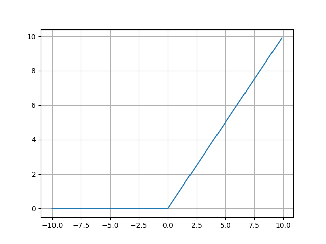

# Understanding Neural Networks from basics

A repository for deep diving into Deep Learning in Python most implementation will be using both Tensorflow and Pytorch framework

<a name='0'></a>

## Topics covered

| Sr. No | Topic Name                            | Markdowns                           | Code and Examples               |
|--------|:--------------------------------------|-------------------------------------|---------------------------------|
| 1.     | Numpy basics           | [Numpy basics](#1) | [Code Numpy basics](Basic_Numpy.ipynb) |
| 2.     | Activation functions                  | [Activation](#2) | [Code activations](Activations) |
| 3.     | Logistic regression as Neural network | [LR as NN](#3)               | [code LR as NN](Log_regression_from_Deeplearning.ipynb)|

<a name='1'></a>

## Numpy Basics

Numpy is a powerful mathematical library used that allows fast and efficient computation. It is maintained by a large community [numpy.org](www.numpy.org).

*****
Numpy contents:

* [Numpy Introduction](#1_1)
* [Numpy arrays](#1_2)
* [Numpy Operations](#1_3)
* [Further Reading on Numpy](#1_4)

*****

<a name='1_1'></a>

### Numpy Introduction

NumPy (Numerical Python) is an open source Python library that’s used in almost every field of science and engineering. It’s the universal standard for working with numerical data in Python, and it’s at the core of the scientific Python and PyData ecosystems. NumPy users include everyone from beginning coders to experienced researchers doing state-of-the-art scientific and industrial research and development. The NumPy API is used extensively in Pandas, SciPy, Matplotlib, scikit-learn, scikit-image and most other data science and scientific Python packages.

Quoted from [numpy.org](www.numpy.org)

Working with numpy arrays is faster than regular python lists.

<a name='1_2'></a>

### Numpy arrays.

*****

```python
#importing numpy library

import numpy as np
np.random.seed(0)  # seed for reproducibility

>>> x1 = np.random.randint(7, size=6)  # One-dimensional array
>>> x2 = np.random.randint(7, size=(3, 4))  # Two-dimensional array
>>> x3 = np.random.randint(7, size=(3, 4, 5)) #Three-dimensional array

>>> print(x1.shape) 
    (6,)
>>> print(x2.shape)
    (3, 4)
>>> print(x3.shape)
    (3, 4, 5)
```

*****

<a name='2'></a>

## Activation function implementation with Numpy

******
Activation contents:

* [Sigmoid activation](#2_1)
* [Tanh activation](#2_2)
* [Rectified Linear Unit(reLu)](#2_3)
* [Softmax activation](#2_4)

******

<a name='2_1'></a>

* ### Sigmoid activation function

The sigmoid function is a mathematics function having a characteristic "S"-shaped curve or sigmoid curve. as writen here
[Sigmoid function](https://en.wikipedia.org/wiki/Sigmoid_function)

Sometimes referred to as a logistic function it is also a non-linear function used in Deep Learning and Logistic regression

$S(x) = \frac{1}{1+e^{-x}}$


Some constraints for sigmoid if the value of x is large positive number the function gives number close to 1
and if x is a negative large number the function results into a number close to 0.

<a name='2_2'></a>

* ### Tanh activation function

The tanh function is a hyperbolic tangent function that is defined by a hyperbola instead of circle
for regular trigonometric functions its results is between -1 and 1 means that whenever we have a large negative number. 
the function gives -1 and if it is a large positive input number the function gives 1.
You can read more about hyperbolic functions here [Hyperbolic functions](https://en.wikipedia.org/wiki/Hyperbolic_functions)

$tanh(x) = \frac{e^{x} - e^{-x}}{e^{x} + e^-{x}}$


<a name='2_3'></a>

* ### Rectified Linear Unit(ReLu)

The ReLu function is a linear function used to remove the negative part of the given array input,
Whenever the input is negative the function will give 0 and for positive inputs it will return that values.
You can read about RelU functions here [Rectified Linear Unit](https://en.wikipedia.org/wiki/Rectifier_(neural_networks))

$f(x) = max(0, x)$

It may be simplified as: 

```python
def relu(x):
    if x > 0:
        return x
    else:
        return 0
```

#### Here also we can have a leaky relu function which has a small slope for negative values

$f(x) = alpha * x$ if x < 0

$f(x) = x$ if x > 0


<a name='2_4'></a>

* ### Softmax activation

It is a generalization of logistic function with many dimensions.

The softmax function takes as input a vector z of K real numbers, and normalizes it into a probability distribution consisting of K probabilities proportional to the exponentials of the input numbers. That is, prior to applying softmax, some vector components could be negative, or greater than one; and might not sum to 1; but after applying softmax, each component will be in the interval(0,1), and the components will add up to 1, so that they can be interpreted as probabilities. Furthermore, the larger input components will correspond to larger probabilities. Definition from Wikipedia [Softmax](https://en.wikipedia.org/wiki/Softmax_function)

Always the sum of softmax distribution gives 1.

$ s(z) = \frac{e^{z_i}}{\sum_{i=1}^{k} e^{z_i}}$
or
$ s(z) = \frac{e^{-z_i}}{\sum_{i=1}^{k} e^{-z_i}}$

<a name='3'></a>

## Logistic Regression as a Neural network

The main goal here is to build an image classifier with a single Logistic regression unit implemented using Numpy.
